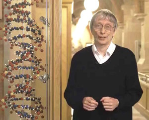
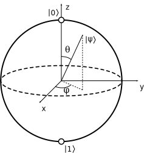
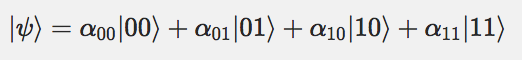
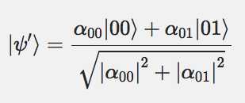

### 1.1.1 量子コンピュータの歴史

* 量子力学
* 計算機科学
* 情報理論
* 暗号理論

---

### 量子力学の歴史

1920年代初頭: 量子力学誕生

1970年代: 単一量子を制御するシステムの発展

1980年代初頭: 量子複製不可能性定理
* 複製可能なら光より早く信号を送れる。

---

### 計算機科学の歴史

#### チューリングマシン(1936)

アラン・チューリング ( Alan Turing )

---

#### チューリングマシン(1936)

計算機を数学的に議論するための単純化・理想化された仮想機械

ハード
* 無限長のテープ
* ヘッド
* ヘッドによる読み書きと、テープの左右へのシークを制御する機能を持つ、有限オートマトン

ソフト
* テープに読み書きされる有限個の種類の記号
* 最初から（初期状態において）テープにあらかじめ書かれている記号列
* 有限オートマトンの状態遷移規則群

---

#### チューリングマシン(1936)

有限オートマトンの状態遷移規則群
* テープの「現在の場所」に新しい記号を書き込む（あるいは、現在の記号をそのままにしてもよい）
* ヘッドを右か左に一つシークする（あるいは、移動しなくてもよい）
* 有限オートマトンを次の状態に状態遷移させる（同じ状態に遷移してもよい）

万能チューリング・マシン
* あらゆるチューリングマシンをシミュレートできるチューリングマシンが可能

#### トランジスタの発明(1947)

ムーアの法則
* 2年ごとに計算能力は2倍に
* 2020年ごろには終焉か
* => 新しいパラダイムの必要

---

#### チャーチ・チューリングのテーゼ(1960年代後期-)

物理的装置で実行できるアルゴリズムという概念と万能チューリングマシンの数学的概念は等価

#### 強いチャーチ・チューリングのテーゼ(1960年代後期-)

「いかなるアルゴリズムもチューリングマシンで効率的にシュミレートできる」

↓しかし

#### ソロベイ・シュトラッセン素数判定法(1977)
=> ランダム性を取り入れたアルゴリズムの可能性

↓
#### 修正された強いチャーチ・チューリングのテーゼ

「いかなるアルゴリズムも確率的チューリングマシンで効率的にシュミレートできる」

---

デイヴィッド・ドイッチュ David Deutch (1985)

確率的チューリングマシンでも効率的に解けないが量子コンピュータなら解ける問題が存在することを示す。

---

#### 量子コンピュータで高速に解けるアルゴリズム

ピーター・ショア Peter Shor (1995)

1. 素因数分解
2. 離散対数問題

Lov Grover (1995)

未整序DBの探索問題の高速化

Richard Feynman(1982)

古典的コンピュータで量子力学系をシミュレートするのは難しい。

量子コンピュータはそれを解決する。

=> 量子力学系のシミュレーションが量子コンピュータの主要なアプリの1つとなる。

---

量子コンピュータのアルゴリズムを見つけるのは難しい

* 人間の直感に反する
* 量子力学を使うだけでなく、古典的コンピュータより速いものでなければならない。

---

### 情報理論の歴史

クロード・シャノン  Claude Shannon 1948

* "通信の数学的理論" ( The Mathmatical Theory of Communication )

1. シャノンの情報源符号化定理(シャノンの第一基本定理)
   * データ圧縮の可能な限界と情報量（シャノンエントロピー）の操作上の意味を確立する定理
   * => 情報を保存するには物理的リソースが必要

2. シャノンの通信路符号化定理(シャノンの第二基本定理)
   * ノイズを含む通信経路でどれだけエラーのないデータを送れるかを示す

---

ベン・シューマチャー Ben Schumacher (1995)

* 量子ビット(quantum bit, qubit)を定義

CSS codes (Rovert Calderbank, Peter Shor, Andrew steane) 1996
* 量子誤り訂正符号
* 古典的誤り訂正は使えない(<= 複製不可能定理 )

#### 量子テレポテーション ( quantum telepotation )

* 容量0の量子チャネルを往復させると、情報を伝えることができる。

---

### 暗号理論理論の歴史

#### 共通鍵暗号

鍵配送問題
* 第三者によって盗聴される可能性

量子暗号(量子鍵配送)
* 観測されると盗聴者の存在が明らかになる
* 1960年代後半 Stephen Wiesnerが提案
* 1984 Charles Bennet, Gilles Brassardがプロトコルを提唱

#### 公開鍵暗号

RSA暗号、離散対数問題はショアのアルゴリズムで破られる。

---

### 1.2 量子ビット(Qubit, Quantum bits)

1量子ビットの状態　

$$
|\psi\rangle = \alpha|0\rangle + \beta|0\rangle \qquad (\alpha ,\beta \in \mathbb{C}, |\alpha|^2 + |\beta|^2 = 1)
$$

* 古典ビットの0,1 => $ |0\rangle, |1\rangle $

* $ | \rangle $ : ディラック(Dirac)の記法、ブラケット記法

* 2次元複素ベクトル空間のベクトル
    + $ |0\rangle, |1\rangle $ は正規直交基底
    + $ |0\rangle, |1\rangle $ はcomputational basis state(計算基礎状態)

* 量子状態は観測できない $\Leftrightarrow \alpha,\beta$ は観測できない。
* 観測されるまでは、$ |0\rangle$ と $ |1\rangle $ の間の連続的状態をとる。
* 観測されると確率的に0または1と観測される。

---
#### ブロッホ球 Bloch sphere

$$
|\psi\rangle = \alpha|0\rangle + \beta|0\rangle \qquad (\alpha ,\beta \in \mathbb{C}, |\alpha|^2 + |\beta|^2 = 1)
$$
$$
|\psi\rangle = e^{i\gamma}(\cos \dfrac {\theta }{2} + e^{i\gamma}\sin\dfrac {\theta }{2}) \qquad (\theta,\gamma \in \mathbb{R})
$$

$e^{i\gamma}$は観察可能な影響を与えない

$$
|\psi\rangle =\cos \dfrac {\theta }{2} + e^{i\gamma}\sin\dfrac {\theta }{2}
$$

---

$$\sqrt {+}= \dfrac {1}{\sqrt {2}} | 0\rangle + \dfrac {1}{\sqrt {2}} | 1\rangle$$

* 50%の確率で0,50%の確率で1の状態

---

様々な物理システムが量子ビットを実現
* 2つの異なる偏光の光子
* 平等磁界(uniform magnetic field)に置ける核スピンアラインメント
* 単一原子を旋回する電子の状態
    + ground 基底状態
    + excited 励起状態

---

### 1.2.1 複数量子ビット Multiple qubits

2量子状態

1つ目の量子ビットが0と観測されると

<!--
$$
|\psi'\rangle = \dfrac{\alpha_{00}|00\rangle + \alpha_{01}|01\rangle}{\sqrt{|\alpha_{00}|^2+|\alpha_{01}|^2}}
$$
-->

---

### ベル状態 (Bell state, EPR pair)

$$
\frac{|00\rangle + |11\rangle}{\sqrt{2}}
$$

* 量子テレポテーションで重要
* 一方を測定すれば他方もわかる
* Einstein, Podolskey, Rosenが指摘

---

### $n$ 量子ビット

$2^{n}$個の状態